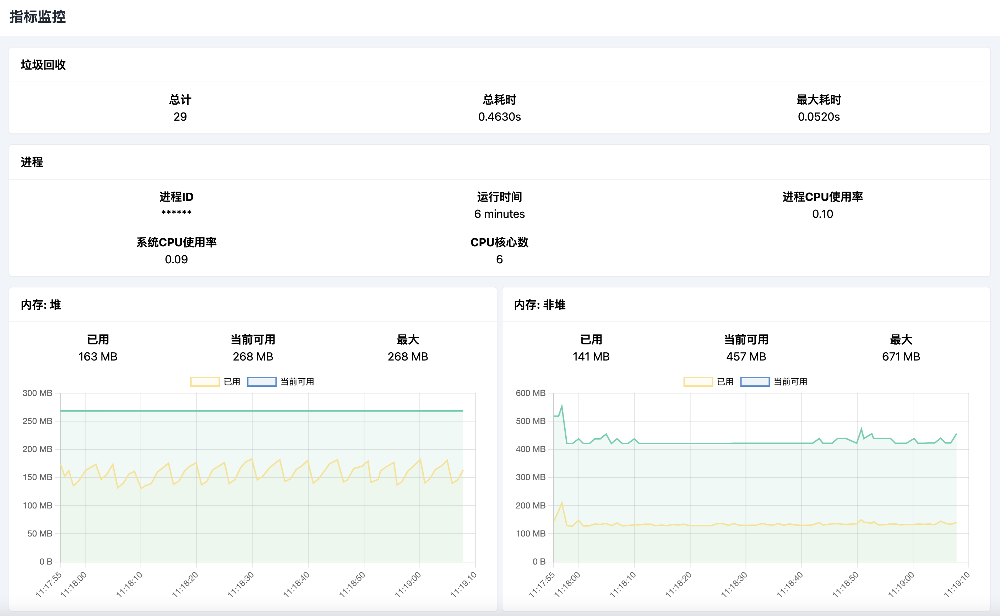

# Metrics Graph

适用于 Halo 2.x 的插件为 Metrics 指标数据提供可视化展示，包括：
- 垃圾回收
- 进程
- 内存
- 线程
- R2DBC 数据源

## 安装
点击到 Halo 应用市场安装插件 [plugin-metrics-graph](https://www.halo.run/store/apps/app-ZZvZq)

## 贡献

如果你有好的意见或建议，欢迎给我们提 [issue](https://github.com/guqing/plugin-metrics-graph/issues)

插件的开发文档请参考 [Plugin Development Guide](https://docs.halo.run/developer-guide/plugin/introduction)